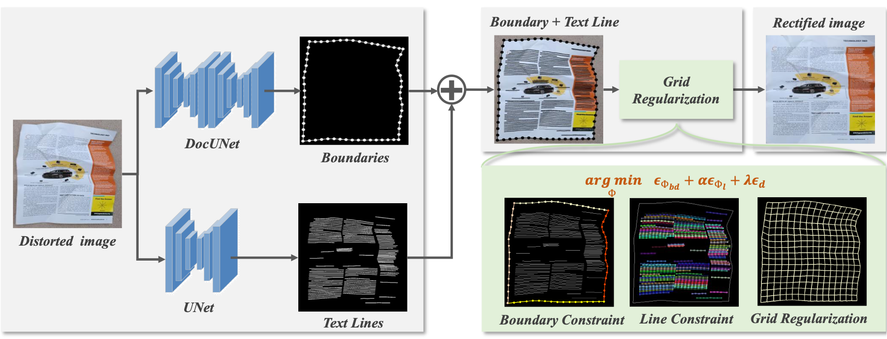

####  Revisiting Document Image Dewarping by Grid Regularization 

This repository contains the source code for our paper:

[ Revisiting Document Image Dewarping by Grid Regularization ]()
CVPR 2022

## Required Data

 To evaluate/train our model, you will need to download the required datasets. 

- [doc3D](https://github.com/cvlab-stonybrook/doc3D-dataset)
- [DocUNet Benchmark](https://www3.cs.stonybrook.edu/~cvl/docunet.html)

```
├── data
	├── crop
├── result
    ├── grid
    ├── tfi
    ├── tps
    ├── text_line
    ├── text_line
    ├── vertical_line
├── datasets
    ├── doc3d
    	├── img
        ├── bm
        ├── uv
        ├── data.txt
    ├── dtd
        ├── images
    ├── textline
        ├── publaynet
        	├── train
        	├── mask        
```

## Inference

Download the pretrained models from [One Drive](https://1drv.ms/u/s!AlagB370HkjxgQrT63yfcAPy9M3n?e=PXaFNQ), and put them to `pkl/`. You can get a result using  `predict.py`:

```
python predict.py --crop data/crop --docunet pkl/docunet.pth --unet pkl/unet.pkl
```

## Evalutaion

- We use the same evaluation code as [DocUNet Benchmark](https://www3.cs.stonybrook.edu/~cvl/docunet.html) dataset on MS-SSIM (multi-scale SSIM) and LD (Local Distortion) based on Matlab 2018b.

- We use the same evaluation code as [DewarpNet](https://github.com/cvlab-stonybrook/DewarpNet)) on CER (Chaacter Error Rate) and ED (Edit Distance)  based on Matlab 2018b.

  ```
  cd result;python test.py
  ```

- We use the Tesseract (v4.0.0-beta.1) default configuration for evaluation with PyTesseract (v0.3.8).

## Training

- Train DocUNet Network to regress boundary points of the document: `python train_b.py`
- Train UNet Network to segment text line in the document: `python train_t.py`